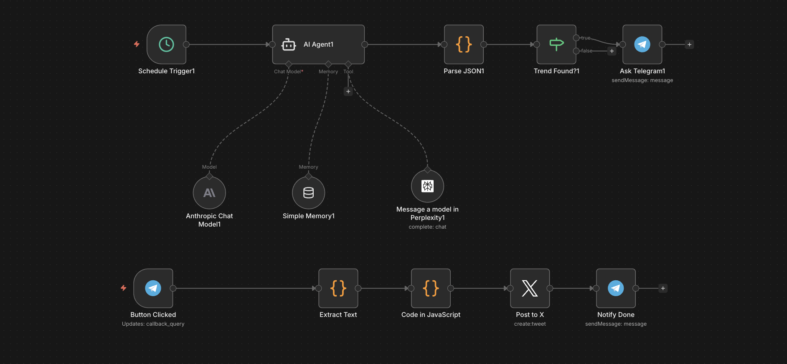

# N8N Twitter Workflow Bot

## Workflow Overview  
This workflow bot manages Twitter functionality through n8n. This diagram below illustrates the different components of the workflow and how they interact with each other.

## Components Documentation  
### Trigger  
The workflow begins with a trigger, determining when the bot will initiate operations based on certain events defined within the workflow. 

### Actions  
- **Post Tweet:** This action will send a tweet to a specified account when triggered.
- **Reply:** It enables the bot to respond to mentions or specific messages.

### Filters  
Filters are crucial for deciding which tweets or interactions to respond to, ensuring that the bot operates efficiently and accurately.

### Execution / Process  
The main processing logic where the incoming events are processed and appropriate actions are executed based on the configuration.

## Conclusion  
This README provides a basic understanding of how the n8n Twitter Workflow Bot operates. For further details, please refer to the documentation or contact the author.
